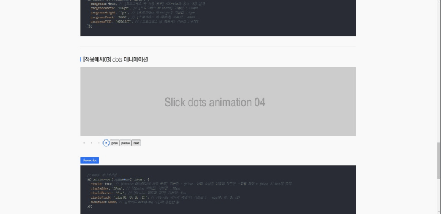

# ✨slickNav.js

[kenwheeler의 slick.js](https://kenwheeler.github.io/slick/) Plugin에 커스텀 네비게이션을 추가한 확장 Plugin 입니다.  
    
slick.js 플러그인은 웹 접근성을 고려한 슬라이드 play/pause 버튼 및 컨트롤 네비게이션들의 UI가 제공되지 않는 불편함이 있습니다. slickNav.js는 이러한 불편함을 해결하기 위한 확장 플러그인으로써 몇가지 간단한 설정만으로 Dots 애니메이션, 프로그레스 바 같은 UI를 제공합니다.

[📃Demo & Usage](http://kyoungsic.coml/projects/plugins/slick_nav)
